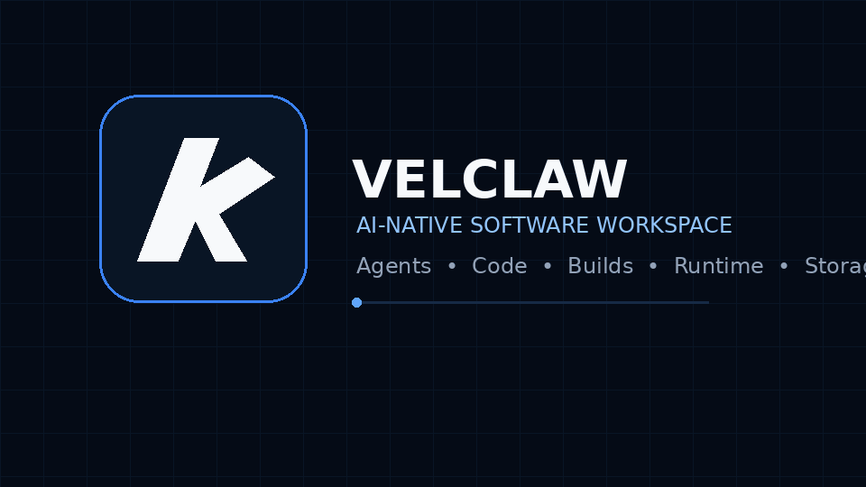
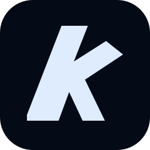

<div align="center">

<a href="https://github.com/Velclaw/Velclaw"></a>

# Velclaw

**AI-native software workspace for agents, developers, and teams.**

Build, inspect, test, deploy, and operate software from one developer-focused workspace.

<p>
<a href="https://github.com/Velclaw/Velclaw"></a>
<a href="https://nextjs.org/"></a>
<a href="https://www.typescriptlang.org/"></a>
<a href="https://nodejs.org/"></a>
</p>

<p><a href="#quick-start">Get started</a> · <a href="#architecture">Architecture</a> · <a href="#capabilities">Capabilities</a> · <a href="#technology-ecosystem">Ecosystem</a> · <a href="#development">Development</a></p>

</div>

---

<div align="center"></div>

## What is Velclaw?

Velclaw is an AI-native software workspace focused on the full software lifecycle: **agents, code, projects, builds, runtime, storage, services, review, and deployment**.

The goal is to give coding agents and developers one coherent environment instead of forcing every workflow through disconnected tools.

> **Build software. Give agents context. Keep the workflow together.**

## Architecture

```text
                         ┌─────────────────────────┐
                         │       AI AGENTS         │
                         │ models · tools · tasks  │
                         └────────────┬────────────┘
                                      │
                                      ▼
┌──────────────────┐       ┌─────────────────────────┐       ┌──────────────────┐
│ Projects & Files │ ◄──── │    VELCLAW WORKSPACE    │ ────► │ Build & Runtime  │
│ code · context   │       │ projects · code · state │       │ build · execute  │
└──────────────────┘       └────────────┬────────────┘       └──────────────────┘
                                        │
                         ┌──────────────┼──────────────┐
                         ▼              ▼              ▼
                    ┌─────────┐   ┌──────────┐   ┌─────────────┐
                    │ Storage │   │ GitHub   │   │ Deployment  │
                    │ data    │   │ review   │   │ delivery    │
                    └─────────┘   └──────────┘   └─────────────┘
```

## Capabilities

| Area | Purpose |
| --- | --- |
| **AI Agents** | Agent-driven development workflows and tool execution |
| **Workspace** | Projects, files, code, persistent context and state |
| **Build** | Build, validate and package software |
| **Runtime** | Execute workloads and development processes |
| **Storage** | Persist application data and files |
| **GitHub** | Repository integration, code review and delivery workflows |
| **Deployment** | Move validated software toward production |
| **Developer UI** | A single workspace for the software lifecycle |

## Technology stack

<p align="center">
<a href="https://nextjs.org/"></a>
<a href="https://react.dev/"></a>
<a href="https://www.typescriptlang.org/"></a>
<a href="https://nodejs.org/"></a>
<a href="https://tailwindcss.com/"></a>
<a href="https://www.postgresql.org/"></a>
</p>

## Quick start

```bash
git clone https://github.com/Velclaw/Velclaw.git
cd Velclaw
npm install
npm run dev
```

Open `http://localhost:3000`.

Validation:

```bash
npm run type-check
npm run build
```

## Project structure

```text
Velclaw/
├── app/                 # Next.js application routes
├── components/          # UI and workspace components
├── lib/                 # application services and integrations
├── public/              # public assets
├── server/              # server-side runtime pieces
├── drizzle/             # database schema/migrations
├── .github/             # CI and automation
└── README.md
```

## GitHub workflow

```text
Issue / Task
     │
     ▼
Agent + Developer
     │
     ▼
Workspace → Code → Build → Typecheck
     │
     ▼
GitHub branch
     │
     ▼
Pull Request → Review → Merge
     │
     ▼
Deployment
```

## Technology ecosystem

These are **open-source ecosystem references, tooling, inspiration, or attribution links**. They are not presented as sponsors unless a separate sponsorship relationship is formally established.

### Core ecosystem

- [Vercel](https://github.com/vercel/vercel)
- [Next.js](https://github.com/vercel/next.js)
- [tsx](https://github.com/privatenumber/tsx)
- [Tenderdash](https://github.com/dashpay/tenderdash)
- [Dash Platform](https://github.com/dashpay/platform)

### Icons, assets and developer tooling

- [Simple Icons](https://github.com/simple-icons/simple-icons)
- [VectorLogoZone](https://github.com/VectorLogoZone/vectorlogozone)
- [thesvg](https://github.com/glincker/thesvg)
- [developer-icons](https://github.com/zskbot/developer-icons)
- [vscode-icons-svg](https://github.com/giovanigenerali/vscode-icons-svg)
- [profile-readme-generator](https://github.com/maurodesouza/profile-readme-generator)
- [GitAscii](https://github.com/Igorcbraz/GitAscii)
- [GitHub Profile README Generator](https://rahuldkjain.github.io/gh-profile-readme-generator/)

## Credits and attribution

Velclaw references open-source software and community tooling. Each external project remains the property of its respective authors and maintainers; applicable licenses and attribution requirements should be preserved.

## Documentation

- [Velclaw repository](https://github.com/Velclaw/Velclaw)
- [Issues](https://github.com/Velclaw/Velclaw/issues)
- [Pull requests](https://github.com/Velclaw/Velclaw/pulls)
- Documentation URL: add the official Velclaw docs site when it is published.

## Contributing

1. Create a branch.
2. Make the smallest coherent change.
3. Run typecheck/build where applicable.
4. Open a pull request.
5. Address review feedback.
6. Merge after required checks pass.

## Security

Do not commit credentials, API keys, OAuth secrets, database URLs or private deployment tokens.

## Roadmap

The roadmap should reflect shipped work rather than fictional dates or commitments.

- [x] Core workspace
- [x] GitHub integration foundation
- [x] Build/runtime workflow foundation
- [ ] Expand agent workflows
- [ ] Expand deployment automation
- [ ] Dedicated documentation site
- [ ] Production-grade observability
- [ ] Broader ecosystem integrations

## License

The current project configuration identifies Velclaw as private software. Do not claim an open-source license until a `LICENSE` file and public licensing decision are present.


## Visual identity

<div align="center">


<br />



</div>

The repository includes the official Velclaw mark and a lightweight product-introduction GIF so the project identity remains visible throughout the README rather than only in the hero.


---

<div align="center">


**Velclaw**  
*Code. Innovate. Elevate.*

<a href="https://github.com/Velclaw/Velclaw">GitHub</a> ·
<a href="https://github.com/Velclaw/Velclaw/issues">Issues</a> ·
<a href="https://github.com/Velclaw/Velclaw/pulls">Pull Requests</a>

</div>
